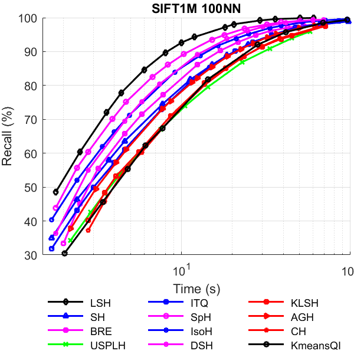

Search with A Hash Index 
============
We provide here the codes for search with a hash index (and a kNN graph). The codes are used in our paper [A Revisit of Hashing Algorithms for Approximate Nearest Neighbor Search](http://arxiv.org/abs/1612.07545).    

You need a hash index and a kmeans partition for search. Please use the [matlab codes](https://github.com/dengcai78/MatlabFunc/tree/master/ANNS/Hashing) of various hashing algorithms to generate the hash index and a kmeans partition.

Benchmark data set
-------
* [SIFT1M and GIST1M](http://corpus-texmex.irisa.fr/)

The performance was tested without parallelism.   

ANN search using hash index (quantization hamming ranking approach)
------

     
     
    
    

How To Complie    
-------
Go to the root directory of hashingSearch and make.    

	cd hashingSearch/
	make

How To Use    
------
You need a hash index and a kmeans partition for search. Please use the [matlab codes](https://github.com/dengcai78/MatlabFunc/tree/master/ANNS/Hashing) of various hashing algorithms to generate the hash index and a kmeans partition.

* ANN search with a hash index using quantization hamming ranking approach

		cd samples/
		./ikhamming_search  data_file BaseCodeFile query_file QueryCodeFile partitionFile result_file codelen initsz nPartition querNN

  Meaning of the parameters(from left to right):   

	data_file     -- database points  
	BaseCodeFile  -- e.g. LSHtableSIFT32b. (The actual binary code file is LSHtableSIFT32b_1, LSHtableSIFT32b_2, ..., the program will automatically load the required number of bits specified by the codelen parameter)  
	query_file    -- sift query points  
	QueryCodeFile -- e.g. LSHquerySIFT32b. (The actual binary code file is LSHquerySIFT32b_1, LSHquerySIFT32b_2, ..., the program will automatically load the required number of bits specified by the codelen parameter)  
    partitionFile -- a partition of the dataset, can be generated by kmeans (please see our matlab code for the format)
	result_file   -- path to save ANN search results of given query   
	codelen       -- code length of the binary codes. (A long code will be split as multiple 32-bits tables for convenience)   
	initsz        -- initial pool size, the parameter L in the paper  
    nPartition    -- specify the number of nearest partitions to be examined. (these two parameters "initsz" and "nPartition" should grow at the same time. Actually, there is an optimal mapping between them)
    querNN        -- required number of returned neighbors (i.e. k of k-NN)   

* ANN search with a hash index using hamming ranking approach

		cd samples/
		./hamming_search  data_file BaseCodeFile query_file QueryCodeFile result_file codelen initsz querNN

  Meaning of the parameters(from left to right):   

	data_file     -- database points  
	BaseCodeFile  -- e.g. LSHtableSIFT32b. (The actual binary code file is LSHtableSIFT32b_1, LSHtableSIFT32b_2, ..., the program will automatically load the required number of bits specified by the codelen parameter)  
	query_file    -- sift query points  
	QueryCodeFile -- e.g. LSHquerySIFT32b. (The actual binary code file is LSHquerySIFT32b_1, LSHquerySIFT32b_2, ..., the program will automatically load the required number of bits specified by the codelen parameter)  
	result_file   -- path to save ANN search results of given query   
	codelen       -- code length of the binary codes. (A long code will be split as multiple 32-bits tables for convenience)   
	initsz        -- initial pool size, the parameter L in the paper  
    querNN        -- required number of returned neighbors (i.e. k of k-NN)   

* ANN search with a hash index using hash bucket search approach

		cd samples/
		./hashing_search data_file BaseCodeFile query_file QueryCodeFile result_file tablelen codelen initsz querNN 

  Meaning of the parameters(from left to right):   

	data_file     -- database points  
	BaseCodeFile  -- e.g. LSHtableSIFT32b. (The actual binary code file is LSHtableSIFT32b_1, LSHtableSIFT32b_2, ..., the program will automatically load the required number of bits specified by the codelen parameter)  
	query_file    -- sift query points  
	QueryCodeFile -- e.g. LSHquerySIFT32b. (The actual binary code file is LSHquerySIFT32b_1, LSHquerySIFT32b_2, ..., the program will automatically load the required number of bits specified by the codelen parameter)  
	result_file   -- path to save ANN search results of given query   
	tablelen      -- table length. (A long code will be stored in multiple tables for effeciency. Please see our paper for details. ) The maximum tablelen is 64.  
    codelen       -- code length of the binary codes. (A long code will be split as multiple 32-bits tables for convenience)   
    initsz        -- initial pool size, the parameter L in the paper  
    querNN        -- required number of returned neighbors (i.e. k of k-NN)   

Output and Input format
------
Same as that of [EFANNA](https://github.com/fc731097343/efanna)

